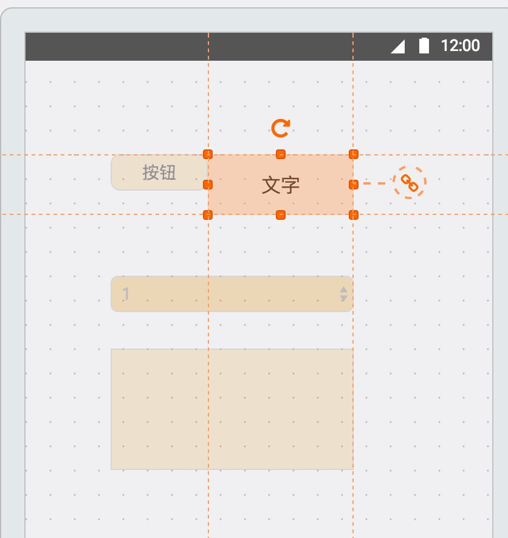

# autoPosLine

> 网格系统中的智能引导线

## 前言

核心实现一个编辑坐标区 提示线功能

参考案例
- [墨刀编辑器](https://modao.cc)
- [易企秀](http://www.eqxiu.com/)

功能描述
- 已知width,height的容器container
- 已知width,height的一个网格大小girdSize
- 任意宽高的元素element
- element可以拖拽 范围在container内
- 当拖拽时 提示当前元素在坐标系的一个状态

 > 检查当前元素横向 纵向 垂直方向与其他元素的情况 进而提示引导线

## TODO
构建基础场景
- [ ] 创建基础组件

组件 | 描述
---|---
containerComponent | 容器组件 提供基础布局 ，大小，可拖拽，出滚动条
elementComponent | 元素组件 提供基础拖拽自适应

