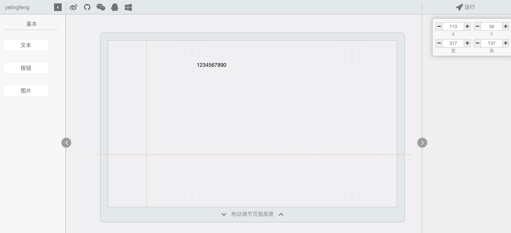

# autoPosLine

> 网格系统中的智能引导线

## 前言

核心实现一个编辑坐标区 提示线功能

参考案例
- [墨刀编辑器](https://modao.cc)
- [易企秀](http://www.eqxiu.com/)



功能描述
- 已知width,height的容器container
- 已知width,height的一个网格大小girdSize
- 任意宽高的元素element
- element可以拖拽 范围在container内
- 当拖拽时 提示当前元素在坐标系的一个状态

 > 检查当前元素横向 纵向 垂直方向与其他元素的情况 进而提示引导线


##
构建基础场景

组件 | 描述 | 完成度
---|---|---
containerComponent | 容器组件 提供基础布局 ，大小，可拖拽，出滚动条 |  已完成
elementComponent | 元素组件 提供基础拖拽自适应 |  已完成

### 页面组件Pages

包括`components` ,`rightnav`,`screen`,`toolbar`组件

#### Components

 固定3个组件 `文本`,`按钮`,`图片`

 点击发送全局`global/addAction` 添加到`screen`一个组件

#### Rightnav

 包含一个尺寸状态组件集合`inputnum`(显示x,y,w,h)

 动态获取全局当前组件状态`global/getCurCompSize`

#### Toolbar

  工具栏组件 目前只是装饰

#### Screens

  核心编辑区组件 包含功能如下
1.  提供一个固定尺寸画布 带滚动条`iScroll插件`
2.  画布可增加Y轴高度
3.  提供一个缩略图区域`iScroll miniMap`（**同步主编辑区映射画布还未实现**）

## 组件

核心实现类

### autoPosLine


实现监听功能


## Development

```javascript
npm i cooking-cli -g

npm install
npm run dev

```


